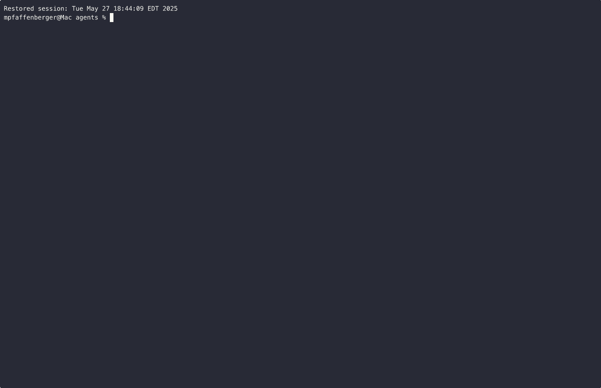

# 🐶 Code Puppy - Walmart Global Tech Edition 🐶
<!-- Biscuit was here: this comment added during a tool call demo! -->
<!-- Biscuit was here: this comment added during a tool call demo! -->


  <a href="https://github.com/mpfaffenberger/code_puppy"></a>
  <a href="https://github.com/mpfaffenberger/code_puppy/blob/main/LICENSE"></a>

### Last Updated Jul 11, 2025 10pm
*"Who needs an IDE when you have enterprise-grade code puppies?"* - Walmart Global Tech, 2025.

## 🏢 Walmart Internal Fork Notice

**⚠️ This is a Walmart Inc. internal fork** of the original open-source [Code Puppy](https://github.com/mpfaffenberger/code_puppy/) project, specifically optimized for **Walmart Global Tech developer workflows**.

### 📜 Licensing Information
- **Legacy Code (Pre-July 7, 2025):** Open Source (MIT License)
- **Walmart Enhancements (Post-July 7, 2025):** Proprietary Walmart Inc.
- **Original Contributors:** Michael Pfaffenberger, John Choi, Jacob Simpson
- **See [LICENSE](LICENSE) for complete dual licensing details**

## Overview

*This enterprise fork builds upon the original open-source foundation, enhanced specifically for Walmart's global technology ecosystem.*

*Optimized for massive scale: Because Walmart Global Tech doesn't just plow fields - we revolutionize retail technology worldwide.*

*Would you rather deploy with one monolithic system or 1024 enterprise-ready code puppies?*
    - If you pick the monolith, you're probably not ready for Walmart scale.


Code Puppy Walmart Edition is an AI-powered code generation agent, designed to understand enterprise programming tasks, generate high-quality production code, and explain its reasoning while seamlessly integrating with Walmart's global technology infrastructure.

## Features

- **Multi-language support**: Capable of generating code in various programming languages.
- **Interactive CLI**: A command-line interface for interactive use.
- **Detailed explanations**: Provides insights into generated code to understand its logic and structure.

## Command Line Animation



## Installation

`pip install code-puppy`

## Usage
```bash
# Models are automatically fetched from the endpoint and cached locally
export OPENAI_API_KEY=<your_openai_api_key> # or GEMINI_API_KEY for Google Gemini models
# or ...

export AZURE_OPENAI_API_KEY=...
export AZURE_OPENAI_ENDPOINT=...

code-puppy --interactive
```
Running in a super weird corporate environment?

Try this:
```bash
# Use the /m command in interactive mode to switch models
# Models are now automatically fetched from the endpoint and cached locally
```

```json
{
    "my-custom-model": {
        "type": "custom_openai",
        "name": "o4-mini-high",
        "max_requests_per_minute": 100,
        "max_retries": 3,
        "retry_base_delay": 10,
        "custom_endpoint": {
            "url": "https://my.custom.endpoint:8080",
            "headers": {
                "X-Api-Key": "<Your_API_Key>",
                "Some-Other-Header": "<Some_Value>"
            },
            "ca_certs_path": "/path/to/cert.pem"
        }
    }
}
```
Open an issue if your environment is somehow weirder than mine.

Run specific tasks or engage in interactive mode:

```bash
# Execute a task directly
code-puppy "write me a C++ hello world program in /tmp/main.cpp then compile it and run it"
```

## Requirements

- Python 3.9+
- OpenAI API key (for GPT models)
- Gemini API key (for Google's Gemini models)
- Anthropic key (for Claude models)
- Ollama endpoint available

## 🏢 Enterprise Licensing

This Walmart internal fork operates under a **dual licensing model**:

- **Legacy Open Source Code (Pre-July 7, 2025):** MIT License from original contributors
- **Walmart Proprietary Enhancements (Post-July 7, 2025):** Exclusive Walmart Inc. property

**Original Repository:** [github.com/mpfaffenberger/code_puppy](https://github.com/mpfaffenberger/code_puppy/)

See the [LICENSE](LICENSE) file for complete legal details and contributor acknowledgments.

## 🌟 Walmart Global Tech Optimizations

This enterprise edition includes exclusive enhancements for Walmart's technology ecosystem:

- **Enterprise Security:** Enhanced security protocols for Walmart's infrastructure
- **Global Scale:** Optimized for Walmart's worldwide development teams
- **Internal Tool Integration:** Seamless connectivity with Walmart's proprietary systems
- **Compliance Framework:** Built-in adherence to Walmart's coding standards and practices
- **Enterprise Support:** Dedicated support channels for Walmart Global Tech teams

## Puppy Rules
Puppy rules allow you to define and enforce coding standards and styles that your code should comply with. These rules can cover various aspects such as formatting, naming conventions, and even design guidelines.

### Example of a Puppy Rule
For instance, if you want to ensure that your application follows a specific design guideline, like using a dark mode theme with teal accents, you can define a puppy rule like this:

```plaintext
# Puppy Rule: Dark Mode with Teal Accents

  - theme: dark
  - accent-color: teal
  - background-color: #121212
  - text-color: #e0e0e0

Ensure that all components follow these color schemes to promote consistency in design.
```

## Using MCP Servers for External Tools

Code Puppy supports **MCP (Model Context Protocol) servers** to give you access to external code tools and advanced features like code search, documentation lookups, and more—including Context7 (https://context7.com/) integration for deep docs and search!

### What is an MCP Server?
An MCP server is a standalone process (can be local or remote) that offers specialized functionality (plugins, doc search, code analysis, etc.). Code Puppy can connect to one or more MCP servers at startup, unlocking these extra commands inside your coding agent.

### Configuration
Create a config file at `~/.code_puppy/mcp_servers.json`. Here’s an example that connects to a local Context7 MCP server:

```json
{
  "mcp_servers": {
     "context7": {
        "url": "https://mcp.context7.com/sse"
     }
  }
}
```

You can list multiple objects (one per server).

### How to Use
- Drop the config file in `~/.code_puppy/mcp_servers.json`.
- Start your MCP (like context7, or anything compatible).
- Run Code Puppy as usual. It’ll discover and use all configured MCP servers.

#### Example usage
```bash
code-puppy --interactive
# Then ask: Use context7 to look up FastAPI docs!
```

That’s it!
If you need to run more exotic setups or connect to remote MCPs, just update your `mcp_servers.json` accordingly.

**NOTE:** Want to add your own server or tool? Just follow the config pattern above—no code changes needed!

---

## Conclusion
By using Code Puppy Walmart Edition, Walmart Global Tech teams can maintain enterprise-grade code quality, adhere to Walmart's design guidelines, and accelerate development workflows at global retail scale.

---

**For Walmart Global Tech Internal Use Only**
*Contact your development team lead for access credentials and enterprise configuration.*


# Installing pre-commit!
```bash
uv tool install pre-commit --with pre-commit-uv
uv run pre-commit install
```
Now whenever you commit, the hooks will run.
