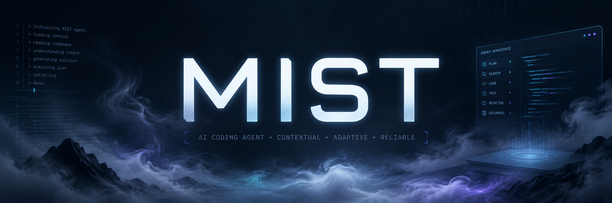

<div align="center">



**Contextual. Adaptive. Reliable.**

[](LICENSE)
[](https://github.com/bajajra/mist/actions)
[](https://bun.sh)
[](https://github.com/bajajra/mist/actions)

[](https://github.com/bajajra/mist)
[](#mist-privacy-commitment)

[](https://github.com/bajajra/mist/stargazers)
[](https://github.com/bajajra/mist/network)

**[Overview](#overview) · [Quick start](#quick-start) · [Parity status](#parity-status) · [Configuration](#configuration) · [Privacy](#mist-privacy-commitment)**

</div>

---


## Overview

Mist is an open-source coding agent that understands large codebases, executes
development workflows, coordinates specialized agents, and works across the
model provider of your choice.

> **Mist is now a Bun/TypeScript application.** It lives in [`ts/`](ts/) and
> ships as a single self-contained binary — no Python, no Node install — with a
> polished Ink/React TUI: a live plan panel, mid-turn steering, session resume,
> context compaction, trace recording, and themes.
>
> The original Python implementation (the `code_puppy/` package) is
> **deprecated and in maintenance mode**, kept as `mist-py` for the transition.
> Bug fixes only — no new features land there. See
> [docs/BUN_MIGRATION_PLAN.md](docs/BUN_MIGRATION_PLAN.md) for the full history.

### Why Bun/TS

The rewrite replaced every load-bearing Python dependency with a TypeScript
equivalent, and compiles to one binary per platform:

| Concern | Before (Python) | Now (Bun/TS) |
|---|---|---|
| Agent engine | `pydantic-ai` | hand-rolled loop on Anthropic-streaming primitives |
| TUI | `rich` + `prompt_toolkit` | **Ink** (React for CLIs) |
| HTTP server | Starlette/uvicorn/sse-starlette | `Bun.serve` *(planned)* |
| Persistence | sqlite (via DBOS) | `bun:sqlite` |
| Distribution | PyInstaller + uvx/pip | **`bun build --compile`** — single-file binary |
| Tests | pytest (~45k lines) | **`bun test`** — rewritten against recorded fixtures |

What carried over **verbatim** (the real IP, all language-agnostic): every
system prompt, the compaction instruction set, the safety model, the
`EventEnvelope` API contract, and the model registry data.

## Quick start

### Primary — Bun/TS binary

```bash
cd ts && bun install && bun run build     # produces ts/dist/mist (single binary)
ln -sf "$PWD/dist/mist" /usr/local/bin/mist   # or anywhere on your PATH
mist                                      # interactive session
mist "fix the failing test"               # one-shot
mist -c                                   # resume latest session here
```

> Requires [Bun ≥ 1.2](https://bun.sh). Run `mist --help` for the full flag list.

### Legacy — Python app (`mist-py`, deprecated)

The original Python app remains installable during the transition:

```bash
uvx --from mist-agent mist-py -i          # published package, bug-fix-only
```

On first run an existing `~/.code_puppy/` install is copied into `~/.mist/`
without deleting or overwriting legacy data.

### Standalone releases

Tagged releases build single-file executables for Linux x64, macOS x64/arm64,
and Windows x64 via `bun build --compile`. Release assets also include a Homebrew
tap and a Scoop manifest. (The PyInstaller release matrix is being retired as the
packaging cutover completes.)

## Parity status

The Bun/TS app is the primary product, but the rewrite is **not yet at full
feature parity** with the old Python app. This is the honest state:

**Ported & shipped**
- Agent loop: streaming, tool dispatch, usage/retry handling.
- Anthropic-protocol streaming, including custom endpoints (minimax, GLM via
  z.ai, etc.) — model onboarding is **pure config**, no engine changes.
- 6-tool belt: `read_file` (ranged), `create_file`, `replace_in_file`
  (exact-match), `list_files`, `grep`, `shell` (guarded).
- Polished Ink TUI: prompt line, streamed markdown rendering, persistent footer
  (heartbeat + step ledger), Cinnamon theme, spinner presets.
- Live plan panel + mid-turn steering (`update_plan` tool + queued nudges).
- `ask_user` clarifying-question tool, `.mist/hooks.json` intent + tool
  guardrails, optional `MIST_HEADROOM=1` tool-result compression.
- Sessions/history autosave, trace recording, transcript export.

**Not yet ported** (tracked in `docs/BUN_MIGRATION_PLAN.md`)
- MCP server support (`@modelcontextprotocol/sdk`).
- Subagents / orchestration.
- The Python plugin system (callbacks are Python-import based).
- DBOS durable execution (`/dbos` toggle).
- `--serve` HTTP/SSE surface and the async SDK client.
- Full theme catalog and the `/` command + config UI.

## Configuration

| What | Where |
|---|---|
| Active model | `~/.mist/mist.cfg`  →  `[mist]\nmodel = glm-5.2` |
| Model registry (built-in + providers) | `~/.mist/extra_models.json` (Anthropic-compatible endpoints) |
| Project intent + tool guardrails | `.mist/hooks.json` |
| Sessions / history | `~/.mist/ts-history` |

### Environment variables

| Variable | Effect |
|---|---|
| `MIST_MODEL` | Override the active model for this run. |
| `MIST_MODELS_JSON` | Point at a custom models registry file. |
| `MIST_ENGINE=python` | Force the legacy Python engine path (transition only). |
| `MIST_HEADROOM=1` | Compress bulky tool results (>2k chars) before they enter history. |
| `MIST_TS_HISTORY` | Override the session-history file location. |

### Adding a model from models.dev

Mist integrates with [models.dev](https://models.dev) (65+ providers, >1000
models). Inside an interactive session:

```
/add_model
```

This opens a TUI to browse providers, preview pricing/context/features, and
one-click add a model with the correct endpoint and API key — fetched live from
models.dev with a bundled offline fallback.

### Round-robin model distribution

To rotate across multiple keys/endpoints and stay under rate limits, add a
`round_robin` entry to `~/.mist/extra_models.json`:

```json
{
  "qwen1": { "type": "cerebras", "name": "qwen-3-coder-480b", "custom_endpoint": { "url": "https://api.cerebras.ai/v1", "api_key": "$CEREBRAS_API_KEY1" }, "context_length": 131072 },
  "qwen2": { "type": "cerebras", "name": "qwen-3-coder-480b", "custom_endpoint": { "url": "https://api.cerebras.ai/v1", "api_key": "$CEREBRAS_API_KEY2" }, "context_length": 131072 },
  "cerebras_round_robin": { "type": "round_robin", "models": ["qwen1", "qwen2"], "rotate_every": 5 }
}
```

Then `/model` → tab → select the round-robin entry. `rotate_every` is the number
of requests served by each member before rotating.

## Usage

```bash
mist                                # interactive session
mist "review this repository"       # one-shot prompt
mist -c                             # continue the latest session in this cwd
mist -r <session-id>                # resume a specific session
mist --sessions                     # list sessions
```

Inside a session, the relevant flags/surface is:
`-c continue · -r <id> resume · --sessions · --help`

## Agent Rules (AGENTS.md)

Mist loads `AGENTS.md` coding standards from multiple locations and combines
them in order:

| Priority | Location | Purpose |
|----------|----------|----------|
| 1 | `~/.mist/AGENTS.md` | Global rules (all projects) |
| 2 | `.mist/AGENTS.md` | Project rules (preferred) |
| 3 | `./AGENTS.md` | Project rules (alternate) |

Global and project rules are combined (global first); `.mist/` takes precedence
over the project root. All filename variants are supported (`AGENTS.md`,
`AGENT.md`, `agents.md`, `agent.md`). See [https://agent.md](https://agent.md).

## Custom commands

Create markdown files in `.claude/commands/`, `.github/prompts/`, or
`.agents/commands/` — the filename becomes the slash command and the body runs
as a prompt:

```bash
echo "# Code Review\n\nPlease review this code for security issues." > .claude/commands/review.md
# then in Mist:
/review with focus on authentication
```

## Requirements

- **Bun ≥ 1.2** (to build from source) or a prebuilt release binary (to just run).
- An API key for at least one provider (Anthropic, OpenAI, Cerebras, GLM/z.ai,
  Ollama, …) — configured via `~/.mist/extra_models.json`.

## Development

The TypeScript workspace is a monorepo under [`ts/`](ts/):

```
ts/
├── packages/
│   ├── core/      # engine: agent loop, tools, config, sessions, compaction, hooks
│   ├── protocol/  # EventEnvelope + API types (ported from code_puppy/events.py)
│   └── tui/       # Ink/React terminal UI
├── package.json   # workspaces: packages/*  ·  scripts: test, build
└── tsconfig.json
```

```bash
cd ts
bun install                  # install workspace deps
bun test                     # run the test suite (24 tests, 11 files)
bun run build                # compile the single-file mist binary to ts/dist/
```

CI runs `bun test` and the legacy Python `pytest` suite on every PR — see
[`.github/workflows/ci.yml`](.github/workflows/ci.yml).

## Migrating from Code Puppy

Mist uses `~/.mist/` for user config and `.mist/` for project-local agents,
skills, and plugins. On first startup an existing `~/.code_puppy/` install is
copied into the new location without overwriting legacy data. The `code-puppy`
and `pup` commands are kept only as compatibility aliases for the deprecated
Python app (`mist-py`) during the transition.

---

# Mist Privacy Commitment

**Zero-compromise privacy policy. Always.**

There is no corporate or investor backing for this project, which means **zero
pressure to compromise our principles for profit**. This isn't a nice-to-have —
it's fundamental to the project's DNA.

### What Mist _absolutely does not_ collect:
- ❌ **Zero telemetry** – no usage analytics, crash reports, or behavioral tracking.
- ❌ **Zero prompt logging** – your code, conversations, and project details are never stored.
- ❌ **Zero behavioral profiling** – we don't track what you build, how you code, or when.
- ❌ **Zero third-party data sharing** – your information is never sold, traded, or given away.

### What data flows where:
- **LLM provider** – your prompts go directly to whichever provider you configured
  (Anthropic, OpenAI, GLM, local, …). This is unavoidable for AI functionality.
- **Complete local option** – run your own VLLM/SGLang/Llama.cpp/Ollama server
  locally → **zero data leaves your network**. Configure it in
  `~/.mist/extra_models.json`.
- **Direct developer contact** – feature requests and bug reports go straight to
  the maintainer. No analytics middlemen.

**This commitment is enforceable because it's structurally impossible to
violate it.** No external pressures, no investor demands, no quarterly targets.
Just solid code that respects your privacy.

## License

This project is licensed under the MIT License — see the [LICENSE](LICENSE) file.
