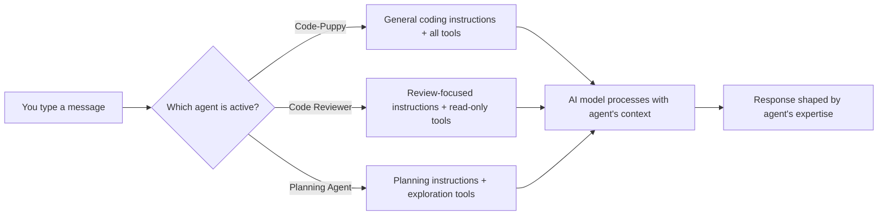

# Understanding Agents

## What Is an Agent?

An **agent** in Code Puppy is a specialized persona that shapes how the AI assistant behaves. Each agent comes with its own personality, expertise, instructions, and set of tools — think of agents as different "modes" for your assistant.

When you talk to Code Puppy, you're always talking to *an* agent. The default is **Code-Puppy 🐶**, a general-purpose coding assistant. But you can switch to a different agent at any time to get specialized help.

## Why Does It Matter?

Different tasks call for different expertise. A general coding assistant is great for writing code, but when you need a focused security audit or a detailed code review, a specialized agent will:

- **Ask the right questions** — Each agent's instructions are tuned for its domain
- **Use the right tools** — Some agents have access to tools others don't (e.g., browser testing, sub-agent orchestration)
- **Follow the right process** — A code reviewer follows a review checklist; a planning agent breaks work into structured steps
- **Maintain separate context** — Each agent keeps its own conversation history, so you can switch freely without losing work

## How It Works (Simplified)



Every agent has three key components:

1. **System Prompt** — Hidden instructions that tell the AI how to behave, what to focus on, and what style to use
2. **Tool Set** — The specific actions the agent can perform (read files, edit files, run commands, invoke other agents, etc.)
3. **Identity** — A name, display name, emoji, and description that help you identify the agent

When you switch agents, Code Puppy swaps out all three components. The AI model itself stays the same (unless you've pinned a different model to the agent).

## Types of Agents

Code Puppy has three categories of agents:

### Built-In Agents

These ship with Code Puppy and cover common development tasks:

| Category | Agents | Best For |
|----------|--------|----------|
| General | Code-Puppy 🐶 | Everyday coding, file editing, running commands |
| Planning | Planning Agent 📋 | Breaking down complex tasks into steps |
| Review | Code Reviewer, Python/JS/TS/Go/C/C++ Reviewers | Analyzing code quality, finding bugs |
| Testing | QA Expert 🐾, QA Kitten 🐱, Terminal QA 🖥️ | Test planning, browser testing, TUI testing |
| Security | Security Auditor 🛡️ | Finding vulnerabilities, suggesting fixes |
| Meta | Prompt Reviewer 📝, Agent Creator 🏗️ | Improving prompts, building new agents |
| Automation | Scheduler Agent 📅 | Creating scheduled tasks |
| Advanced | Helios ☀️ | Creating new tools and capabilities on the fly |

### Custom JSON Agents

You can create your own agents by writing a simple JSON configuration file. Custom agents appear in the agent picker alongside built-in ones. This lets you:

- Define a specialized persona for your project
- Restrict which tools are available
- Write domain-specific instructions
- Share agent configurations with your team

See [How to Create Custom Agents](../Guides/CreateCustomAgents) for details.

### Pack Agents

Pack agents are an advanced multi-agent orchestration system. The **Pack Leader 🐺** coordinates a team of specialized agents (Bloodhound, Husky, Shepherd, Terrier, Watchdog, Retriever) that work in parallel on complex tasks using branching and merging workflows.

Pack agents are hidden by default. Enable them with:

```
/set enable_pack_agents true
```

## Key Terms

| Term | Meaning |
|------|---------|  
| **Active agent** | The agent currently handling your messages |
| **System prompt** | Hidden instructions that shape the agent's behavior and expertise |
| **Tool set** | The specific actions an agent can perform (read files, edit code, run commands, etc.) |
| **Pinned model** | A specific AI model assigned to an agent, overriding the global model selection |
| **Clone** | A copy of an existing agent that you can customize independently |
| **JSON agent** | A custom agent defined by a JSON configuration file |
| **Pack** | A group of agents coordinated by the Pack Leader for parallel workflows |
| **Conversation history** | Each agent maintains its own separate message history |

## Examples

### Example 1: Switching Expertise Mid-Task

You're building a feature and want a review before committing:

1. Start with **Code-Puppy** — write the code
2. Switch to **Code Reviewer** — get feedback on bugs and design
3. Switch back to **Code-Puppy** — apply the suggested fixes

Each agent remembers where you left off, so switching back is seamless.

### Example 2: Using the Right Agent for the Job

You need to audit a web application:

- **Security Auditor** scans for vulnerabilities and suggests remediations
- **QA Kitten** tests the browser UI with Playwright
- **Terminal QA** tests any CLI components

Each agent brings specialized knowledge and tools that a general-purpose assistant wouldn't have.

## Common Misconceptions

> [!CAUTION]
> **Misconception**: Switching agents loses my conversation.
> **Reality**: Each agent preserves its own conversation history. When you switch back, your previous context is still there.

> [!CAUTION]
> **Misconception**: Agents use different AI models.
> **Reality**: By default, all agents use the same AI model. You *can* pin a specific model to an agent, but it's optional.

> [!CAUTION]
> **Misconception**: I need to create custom agents to get value from the system.
> **Reality**: Code Puppy ships with over a dozen built-in agents covering most development tasks. Custom agents are for when you need something truly specialized.

## Tips

> [!TIP]
> **Pin your models strategically.** Use a fast, inexpensive model for routine coding and pin a powerful reasoning model to your code reviewer or security auditor.

> [!TIP]
> **Clone before customizing.** If you want to tweak a built-in agent, clone it first. That way the original is always available as a fallback.

> [!TIP]
> **Use the Agent Creator.** Instead of writing JSON by hand, switch to the Agent Creator agent (`/agent agent-creator`) and describe what you want. It builds the configuration for you.

## Learn More

- [Guide: How to Switch and Use Agents](../Guides/UseAgents) — Browse, switch, pin, and clone agents
- [Guide: How to Create Custom Agents](../Guides/CreateCustomAgents) — Build your own agents
- [Reference: Slash Commands](../Reference/Commands) — The `/agent` command and its options
- [Understanding Context and Compaction](ContextCompaction) — How conversation history is managed
