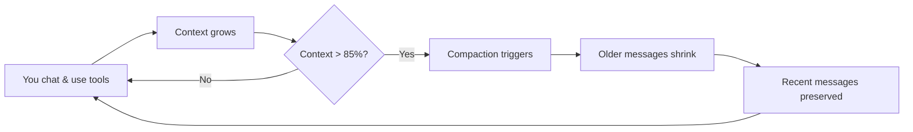

# Understanding Context and Compaction

## What Is Context?

Every time you chat with Code Puppy, your conversation — including your messages, the agent's responses, and all tool calls (file reads, edits, shell commands) — builds up a **context window**. Think of it as the agent's short-term memory: everything it can "see" when deciding what to do next.

Each AI model has a maximum context size, measured in **tokens** (roughly ¾ of a word). For example, a model with a 128,000-token context can hold roughly the equivalent of a 200-page book. Once you approach that limit, something needs to give — and that's where **compaction** comes in.

## Why Does It Matter?

As you work through a long coding session — reading files, making changes, running tests — the conversation history grows quickly. Large file contents, command outputs, and detailed tool responses all consume tokens.

If the context fills up completely, the model can no longer process new messages effectively. Compaction prevents this by shrinking older history while preserving the information you need to keep working.

You'll see a live context usage indicator in the spinner while Code Puppy is thinking, showing how much of the context window is in use.

## How It Works (Simplified)



1. **You work normally** — asking questions, editing files, running commands.
2. **Context grows** — every interaction adds tokens to the history.
3. **Threshold reached** — when context usage exceeds the compaction threshold (default: 85%), compaction kicks in automatically.
4. **Older history shrinks** — the system processes older messages to reduce their size.
5. **Recent work is protected** — your most recent messages are always kept intact so the agent doesn't lose track of what you're doing right now.

## Key Terms

| Term | Meaning |
|------|--------|
| **Context window** | The total amount of text (in tokens) an AI model can process at once |
| **Token** | The smallest unit of text the model works with — roughly ¾ of a word |
| **Compaction** | The process of reducing conversation history to free up context space |
| **Compaction threshold** | The percentage of context usage that triggers automatic compaction (default: 85%) |
| **Protected tokens** | The number of tokens in recent messages that are never compacted (default: 50,000) |
| **Summarization** | A compaction strategy that uses AI to create a condensed summary of older messages |
| **Truncation** | A compaction strategy that simply removes older messages beyond the protected window |

## Compaction Strategies

Code Puppy offers two strategies for handling context overflow:

### Truncation (Default)

The simplest approach — older messages are dropped entirely, keeping only:
- The system prompt (always preserved)
- Any extended thinking context
- Your most recent messages (up to the protected token limit)

**Best for:** Sessions where older history isn't important, or when you want the fastest compaction.

### Summarization

Uses AI to read through older messages and create a condensed bullet-point summary. The summary captures what happened (files read, changes made, decisions taken) without the full details.

For example, a large file read might be summarized as:
> • Used read_file on space_invaders.cpp — contents removed.

**Best for:** Long sessions where you want the agent to remember the overall arc of what you've done.

> [!NOTE]
> Summarization takes a moment to run because it makes an additional AI call to create the summary. Truncation is instant.

## Configuring Compaction

You can adjust compaction behavior with the `/set` command:

### Change the Strategy

```
/set compaction_strategy=summarization
```
or
```
/set compaction_strategy=truncation
```

### Change the Threshold

The threshold controls when automatic compaction triggers. A value of `0.85` means compaction starts when 85% of the context is used:

```
/set compaction_threshold=0.80
```

Valid range: 0.5 (50%) to 0.95 (95%).

- **Lower values** trigger compaction sooner, keeping more headroom but losing history earlier.
- **Higher values** let context fill up more before compacting, preserving more history but leaving less room.

### Change Protected Token Count

The protected token count determines how many tokens of recent messages are never compacted:

```
/set protected_token_count=30000
```

- Default: 50,000 tokens
- Minimum: 1,000 tokens
- Maximum: 75% of your model's context length

> [!TIP]
> If you find the agent "forgetting" recent work after compaction, increase the protected token count. If compaction isn't freeing up enough space, decrease it.

### View Current Settings

Run `/config` to see your current compaction settings:

```
/config
```

You'll see lines like:
```
compaction_threshold:     85.0% context usage triggers compaction
compaction_strategy:      truncation (summarization or truncation)
```

## Manual Compaction

You don't have to wait for automatic compaction. Two commands let you compact on demand:

### `/compact`

Runs compaction using your configured strategy (summarization or truncation):

```
/compact
```

You'll see output like:
```
🤔 Compacting 47 messages using truncation strategy... (~95,000 tokens)
✨ Done! History: 47 → 12 messages using truncation strategy
🏦 Tokens: 95,000 → 28,000 (70.5% reduction)
```

### `/truncate <N>`

Keeps only the N most recent messages, regardless of your compaction strategy:

```
/truncate 10
```

This is useful for a quick reset when you want to start fresh without losing your system prompt.

## Examples

### Example 1: Long Debugging Session

You've been debugging for an hour — reading logs, checking files, running tests. The context is at 90% and compaction fires automatically. With the **truncation** strategy, older file reads and test outputs are dropped, but your last several interactions are preserved. You keep working without interruption.

### Example 2: Multi-Day Feature Development

You're building a feature over multiple sessions. You switch to **summarization** so the agent remembers the big picture:

```
/set compaction_strategy=summarization
```

When compaction triggers, older history becomes a summary like:
> • Read and analyzed the user authentication module  
> • Created new middleware for rate limiting  
> • Fixed 3 failing tests in the auth test suite  
> • User requested adding Redis caching support

The agent retains the narrative while freeing up context space.

### Example 3: Quick Reset

You've gone down the wrong path and want to start over without restarting Code Puppy:

```
/truncate 2
```

This keeps just the system prompt and your last message, giving you a near-clean slate.

## Common Misconceptions

> [!CAUTION]
> **Misconception**: Compaction deletes my files or undoes my changes.  
> **Reality**: Compaction only affects the conversation history in memory. Your files, edits, and saved sessions are completely unaffected.

> [!CAUTION]
> **Misconception**: I should set the threshold to 0.95 to keep maximum history.  
> **Reality**: Running too close to the limit can cause errors if a large response pushes you over. A threshold of 0.80–0.90 gives a healthy buffer.

> [!CAUTION]
> **Misconception**: Summarization is always better than truncation.  
> **Reality**: Summarization adds latency (an extra AI call) and can occasionally miss details. Truncation is faster and more predictable. Choose based on your workflow.

## Tips

> [!TIP]
> Watch the context indicator in the spinner while Code Puppy is working. If you see it climbing above 80% frequently, consider lowering your compaction threshold or reducing the protected token count.

> [!TIP]
> Starting a new session with `/session new` gives you a completely fresh context — useful when switching to an unrelated task.

> [!TIP]
> If compaction triggers during an active operation (while tool calls are running), Code Puppy will automatically defer compaction until the operation completes. You don't need to worry about interruptions.

## Learn More

- [Guide: How to Manage Sessions and History](../Guides/ManageSessions) — Save, load, and manage your chat sessions
- [Reference: Configuration Options](../Reference/ConfigReference) — All available settings
- [Reference: Slash Commands](../Reference/Commands) — Full command reference including `/compact` and `/truncate`
